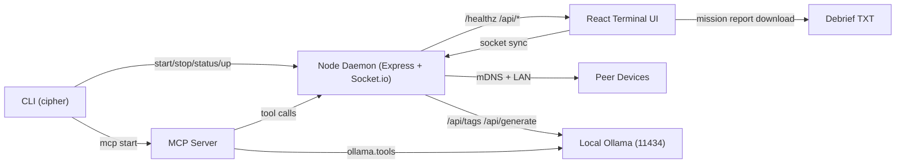

# CIPHER.SYS // TERMINAL

> The to-do app that wants you gone.

[](https://www.npmjs.com/package/@cipher.sys/terminal)
[](https://github.com/sir-ad/cipher.sys)


CIPHER is a constraint engine for people who keep drowning in productivity software.
No folders. No backlog theater. No comfort UI. Just execution pressure.

## Premise
Most productivity tools optimize for managing work, not finishing work.
CIPHER flips the axis:

1. Hard-cap active tasks to 5.
2. Expire stale tasks after 7 days.
3. Self-destruct once all active work is done.

The best outcome is that you stop needing the app.

## Problems We Solve
- Endless backlog creep and decision paralysis.
- Port/process confusion from stale local daemons.
- Localhost tab drift (wrong app on same port).
- Fake “done” loops without social accountability.
- Cross-device continuation friction on LAN-only workflows.

## Deep Tech Features
- Auto-Clean Bootstrap Runtime: `cipher up` always runs `stop -> clean -> start -> health-check -> open`.
- Daemon Health Contract: `/healthz` + `X-Cipher: 1` for deterministic process detection.
- Legacy Process Recovery: CLI can detect and terminate older listeners on `:4040`.
- Runtime State Journal: PID/state artifacts under a dedicated runtime directory for reliable lifecycle control.
- Multiplayer Mesh via Socket.io: delegated directives, kill verification, squad telemetry, integrity strikes.
- mDNS LAN Discovery: `cipher.local` resolution + network IP signaling for device join flows.
- MCP Server + Tool Surface: task/state/discovery control + Ollama tool bridge.
- Host Termination Broadcast: `host_terminating` socket event for synchronized shutdown UX.
- Mission Debrief Export: session summary auto-downloaded when terminal burns.
- Browser State Wipe Protocol: local identity/session/task keys purged on destruct path.
- Procedural Audio Engine: WebAudio-generated keystrokes, alarms, pings, purge noise, ringtone.
- Local LLM Handler: Ollama detection + hostile sitrep generation without cloud dependency.

## Protocols
See full protocol specs in [Runtime Protocols](docs/architecture/protocols.md). Core protocols:

- `AUTO_CLEAN_BOOTSTRAP`
- `THERMAL_DECAY`
- `SCORCHED_EARTH`
- `SYNDICATE_DELEGATION`
- `TWO_KEY_TURN`
- `HOST_TERMINATION_BROADCAST`
- `MISSION_DEBRIEF`
- `LOCAL_LLM_INTERROGATION`

## Cross-Device Resume
CIPHER is LAN-first and accountless.
Resume works by combining:

- daemon-side state sync over Socket.io,
- local browser persistence for fast reconnect,
- LAN discovery (`cipher.local` + network IP),
- manual IP override fallback for strict networks.

## Audio + UX Signals
UI direction is sci-fi tactical console: CRT scanline aesthetic, hard contrast, and aggressive status feedback.
Mission-style audio is generated in-browser (WebAudio), not loaded from static sound files.

## Story: Operation Black Ledger
You are an operative with five payload slots and no backup queue.
Every directive is on a fuse. Ignore it long enough, and the system burns it down.

In Syndicate mode, your squad can assign you targets.
You can claim completion, but another operator still turns the second key.
No second key, no kill.

When the board reaches zero, CIPHER executes Scorched Earth,
hands you a mission debrief file, and terminates the host process.
Mission accomplished means the app exits the stage.

## Architecture
Detailed architecture: [System Architecture](docs/architecture/system-architecture.md)



## Install

```bash
# one-shot
npx @cipher.sys/terminal@latest

# global install
npm install -g @cipher.sys/terminal
```

Global install runs postinstall bootstrap automatically.

## Command Surface

```bash
cipher up                 # stop-clean-start-open
cipher stop               # stop daemon + cleanup runtime artifacts
cipher status             # daemon + mcp health
cipher open               # open app (bootstraps if needed)
cipher mcp start          # start MCP in background
cipher mcp start --foreground
```

## Public Interfaces

### CLI
- `cipher up`
- `cipher stop`
- `cipher status`
- `cipher open`
- `cipher mcp start`

### HTTP
- `GET /healthz` (`X-Cipher: 1`)
- `GET /api/discovery`
- `GET /api/state`
- `GET /api/tasks`
- `POST /api/tasks`
- `POST /api/tasks/:id/complete`
- `POST /api/tasks/:id/delete`
- `POST /api/shutdown`

### Socket
- `host_terminating`

### MCP tools
- `cipher.health`
- `cipher.discovery`
- `cipher.state`
- `cipher.list_tasks`
- `cipher.add_task`
- `cipher.complete_task`
- `cipher.delete_task`
- `ollama.tags`
- `ollama.generate`

## Docs
- [Field Manual](https://sir-ad.github.io/cipher.sys/docs/)
- [Boot Sequence](docs/briefing/boot-sequence.md)
- [System Architecture](docs/architecture/system-architecture.md)
- [Runtime Protocols](docs/architecture/protocols.md)
- [Syndicate PRD](docs/multiplayer/prd-syndicate.md)

## Release Tracks
GitHub and npm releases are intentionally separate workflows.

- GitHub track: branch + PR + merge.
- npm track: publish later from an intended commit SHA.

---
Built for people who ship, not people who color-code backlogs.
