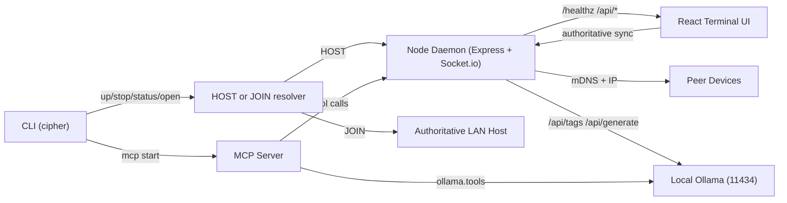

# CIPHER.SYS // TERMINAL

> The to-do app that wants you gone.

[](https://www.npmjs.com/package/@cipher.sys/terminal)
[](https://github.com/sir-ad/cipher.sys)


CIPHER is a constraint engine for people who keep drowning in productivity software.
No folders. No backlog theater. No comfort UI. Just execution pressure.

## Premise
Most productivity tools optimize for managing work, not finishing work.
CIPHER flips the axis:

1. Hard-cap active tasks to 5.
2. Expire stale tasks after 7 days.
3. Self-destruct once all active work is done.

The best outcome is that you stop needing the app.

## Reliability Hotfix (v5.0.1)
- **Single authoritative host by default:** secondary devices auto-join host instead of spawning isolated daemons.
- **mDNS is best-effort:** `cipher.local` is attempted first, but direct host-IP fallback is always supported.
- **Authority-first sync:** clients trust daemon `sync_state`; disconnected clients cannot silently mutate task state.
- **ASCII banner parity:** banner is shown during install and during CLI launch (`cipher`, `cipher up`).

## Deep Tech Features
- Auto-Clean Bootstrap Runtime: `cipher up` runs local `stop -> clean -> probe -> join/start -> open`.
- Host/Join Runtime Modes: CLI reports `HOST|JOIN` and active target URL.
- Runtime State Journal: PID/state artifacts under a dedicated runtime directory.
- mDNS Discovery + IP Fallback: resilient LAN join model.
- MCP Server + Tool Surface: task/state/discovery control + Ollama bridge.
- Host Termination Broadcast: `host_terminating` socket event for synchronized shutdown UX.
- Mission Debrief Export: session summary auto-downloaded when terminal burns.
- Browser State Wipe Protocol: local identity/session/task keys purged on destruct path.
- Procedural Audio Engine: WebAudio-generated keystrokes, alarms, pings, purge noise, ringtone.
- Local LLM Handler: Ollama detection + hostile sitrep generation without cloud dependency.

## Architecture
Detailed architecture: [System Architecture](docs/architecture/system-architecture.md)



## Install

```bash
# one-shot
npx @cipher.sys/terminal@latest

# global install
npm install -g @cipher.sys/terminal
```

Global install runs postinstall bootstrap automatically.

## Command Surface

```bash
cipher up                            # stop-clean, then auto-join LAN host or start local host
cipher up --host                     # force local host mode
cipher up --join 192.168.1.5         # force join explicit host
cipher stop                          # stop daemon + cleanup runtime artifacts
cipher status                        # host/join + mcp status
cipher open                          # open active target (host or join)
cipher mcp start                     # start MCP in background
cipher mcp start --foreground
cipher --quiet up                    # suppress launch banner
```

## Public Interfaces

### CLI
- `cipher up`
- `cipher up --host`
- `cipher up --join <ip-or-url>`
- `cipher stop`
- `cipher status`
- `cipher open`
- `cipher mcp start`

### HTTP
- `GET /healthz` (`X-Cipher: 1`)
- `GET /api/discovery` (includes `join.*` + `mdns.*` health)
- `GET /api/state`
- `GET /api/tasks`
- `POST /api/tasks`
- `POST /api/tasks/:id/complete`
- `POST /api/tasks/:id/delete`
- `POST /api/shutdown`

### Socket
- `host_terminating`

### MCP tools
- `cipher.health`
- `cipher.discovery`
- `cipher.state`
- `cipher.list_tasks`
- `cipher.add_task`
- `cipher.complete_task`
- `cipher.delete_task`
- `ollama.tags`
- `ollama.generate`

## Troubleshooting
- `cipher.local` fails: use `http://<host-ip>:4040` and UI IP OVERRIDE.
- Tasks not syncing: ensure all devices join one authoritative host (`cipher status`).
- Suspected duplicate daemon: run `cipher stop` then `cipher up`.

## Docs
- [Field Manual](https://sir-ad.github.io/cipher.sys/docs/)
- [Boot Sequence](docs/briefing/boot-sequence.md)
- [System Architecture](docs/architecture/system-architecture.md)
- [Runtime Protocols](docs/architecture/protocols.md)
- [Syndicate PRD](docs/multiplayer/prd-syndicate.md)

## Release Tracks
GitHub and npm releases are intentionally separate workflows.

- GitHub track: branch + PR + merge.
- npm track: publish later from an intended commit SHA.

---
Built for people who ship, not people who color-code backlogs.
