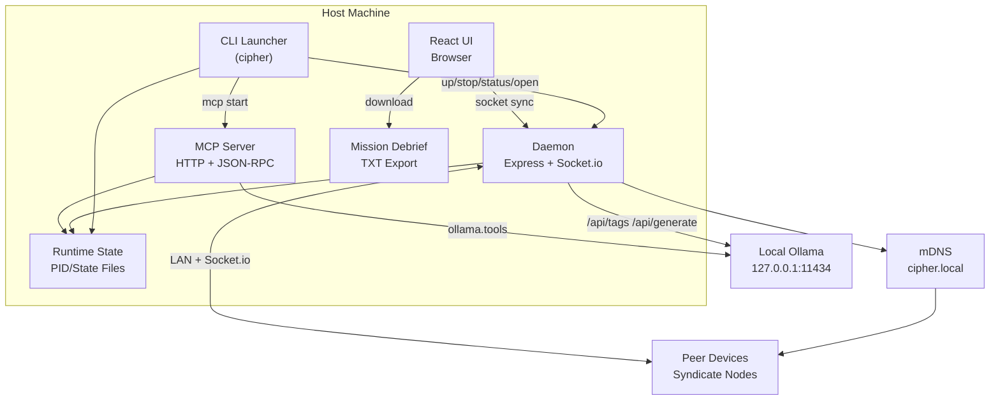

# SYSTEM ARCHITECTURE

CIPHER runs as a local-first command runtime with a detached daemon, browser UI, and optional MCP control layer.

## Topology

## Core Components

### 1) CLI Runtime Controller
- Enforces deterministic lifecycle (`cipher up`, `cipher stop`, `cipher status`).
- Detects stale listeners on `:4040` and recovers cleanly.
- Owns runtime artifact cleanup and daemon bootstrap.

### 2) Detached Daemon
- Hosts static UI and real-time socket channels.
- Owns source-of-truth task/squad state in memory.
- Exposes health and control endpoints for CLI/MCP automation.

### 3) Browser UI
- React front-end with tactical interaction model.
- Handles local task interaction, mission flow, and visual/audio feedback.
- Maintains local persistence for resume continuity.

### 4) MCP Server
- Exposes structured tool surface for external agents and automation.
- Bridges to daemon APIs and optional Ollama endpoints.

### 5) Local LLM Handler (Ollama)
- Daemon probes local Ollama for model availability.
- Generates contextual handler messages from local host/task telemetry.

## Data and Control Flows

### Bootstrap Flow
1. `cipher up` executes stop-clean-start-open.
2. Daemon starts detached and writes runtime state.
3. CLI waits for `/healthz` (`X-Cipher: 1`).
4. Browser opens to local terminal.

### Multiplayer Flow (Syndicate)
1. Nodes connect via Socket.io.
2. Delegation, verification, and integrity events replicate in real time.
3. Burn/termination events synchronize across active clients.

### Mission Completion Flow
1. All tracked targets complete (or burn initiated).
2. Debrief report generated and downloaded.
3. Host termination event emitted.
4. Browser state wiped and daemon exits.
